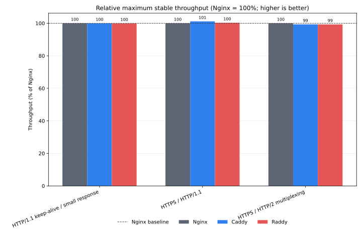

# Raddex

[](https://github.com/chulingera2025/raddex/actions/workflows/ci.yml)
[](LICENSE)
[](https://github.com/chulingera2025/raddex/releases)
[](https://www.rust-lang.org/)

[Chinese documentation](README.zh_CN.md)

Raddex is a small reverse-proxy gateway written in Rust and built on
[Cloudflare Pingora](https://github.com/cloudflare/pingora). It combines a
readable, Caddy-style configuration file with Pingora's multi-threaded proxy
engine, shared upstream pools, and memory safety.

## The short version

Use Raddex when you want one binary to handle HTTP/HTTPS routing, automatic TLS,
static files, upstream load balancing, and selected TCP/UDP workloads without
turning the configuration into application code.

Raddex's defining rule is simple: directives in a site block are interpreted in
the order you write them. Terminals decide who serves the request; modifiers
and guards describe how that terminal behaves. The model is explicit rather
than dependent on a hidden ordering table.

## Release surface

Raddex `v0.3.5` is a pre-1.0 release. The following table describes what is
implemented and tested in this release; it is not a promise that every public
API is already frozen.

| Area | Included | Boundary |
| --- | --- | --- |
| HTTP reverse proxy | HTTP/1.1, downstream HTTP/2, WebSocket upgrades, load balancing, health checks | Rate limits are per process |
| TLS and ACME | HTTP-01, Cloudflare DNS-01, TLS-ALPN-01, static certificates, internal certificates, mTLS | TLS-ALPN-01 is for eligible ACME sites on port 443 and cannot be combined with DNS-01; other DNS-01 providers are not included |
| Upstream protocols | HTTP/1.1, `https://`, `h2://`, `h2c://` | `h2c://` requires prior-knowledge HTTP/2 upstreams |
| Site routing | Multiple domains, IPv4/IPv6, exact and one-label wildcard matching | Wildcards do not match the apex or multiple labels |
| Layer 4 | TCP, SNI passthrough, TCP TLS termination, UDP datagram proxying | Transparent TCP and UDP handoff are Linux-only integrations |
| Operations | Config check, SIGHUP reload, zero-downtime binary upgrade, JSON/Prometheus output | Listener topology changes require a normal restart; upgrades require unchanged topology |
| QUIC / HTTP/3 | UDP datagram passthrough | HTTP/3 termination and routing require a separate QUIC service or sidecar |

## Five-minute local proxy

Install a release binary, or build from source, then start a local upstream:

```bash
python3 -m http.server 8080 --bind 127.0.0.1
```

Create `Raddexfile`:

```caddyfile
example.local:8090 {
    reverse_proxy 127.0.0.1:8080
}
```

Validate and run Raddex in another terminal:

```bash
raddex check -c Raddexfile
raddex run -c Raddexfile
```

Send a request with the site Host header:

```bash
curl -H 'Host: example.local' http://127.0.0.1:8090/
```

`raddex check` performs the same configuration validation used by reload. Keep
it in deployment scripts and CI before starting or reloading the service.

## Relative performance benchmark

The repository includes a Docker comparison suite for Nginx, Caddy, and Raddex.
It uses the same origin and scenario for each target and normalizes every
scenario against Nginx (`1.00x = 100%`).



Run it locally with:

```bash
./bench/scripts/run.sh quick
```

See the [benchmark documentation](docs/PERFORMANCE.md) for the full matrix,
relative-metric rules, and generated report locations.

## A production-shaped site

```caddyfile
{
    acme_email ops@example.com
    trusted_proxies 10.0.0.0/8 192.168.0.0/16
}

:80 {
    redir https://{host}{uri} permanent
}

api.example.com {
    rate_limit remote_ip 100r/s burst=200

    handle /static/* {
        root /var/www/html
        file_server
        encode zstd gzip
    }

    reverse_proxy {
        to https://10.0.0.11:8443 https://10.0.0.12:8443
        tls_servername api.internal
        health_check {
            interval 5s
            timeout 2s
        }
    }
}
```

The default ACME method is HTTP-01. Use `dns_challenge` when port 80 cannot be
reached, or `tls_alpn_challenge` when the ACME server can reach TCP 443 and the
site is eligible for TLS-ALPN-01.

If either backend uses a private CA, add `tls_ca <path>` to the
`reverse_proxy` block and ensure the file exists before running `raddex check`.

## Documentation map

- [Documentation site](https://chulingera2025.github.io/raddex/) — task-oriented guides and reference.
- [Installation and deployment](docs/INSTALL.md) — release binaries, Docker, systemd, permissions, and upgrades.
- [Raddexfile specification](docs/RADDEXFILE_SPEC.md) — configuration semantics and compatibility source of truth.
- [Architecture and capability boundaries](docs/PINGORA_CAPABILITY_RESEARCH.md) — what is native, application-level, Linux-only, or sidecar-based.
- [Layer 4 architecture](docs/L4_PROXY_PLAN.md) — TCP/UDP runtime model and operational invariants.
- [Performance comparison](docs/PERFORMANCE.md) — the Docker comparison suite and normalized metrics.
- [Release checklist](docs/RELEASE_CHECKLIST_v0.3.5.md) — historical release evidence.

## Build from source

```bash
cargo build --release --locked
./target/release/raddex --version
```

Stable Rust, OpenSSL development libraries, and CMake are required for a
source build. Prebuilt release artifacts currently target Linux GNU on
`x86_64` and `aarch64`.

## Project status

The released tree contains the HTTP/TLS gateway, the Raddexfile parser and
validator, automatic HTTPS, the migration tool, observability, and the tested
TCP/UDP extensions described above. Work that depends on a separate QUIC
transport is intentionally kept outside the Pingora process. See the
[capability document](docs/PINGORA_CAPABILITY_RESEARCH.md) before deploying a
protocol that needs termination rather than passthrough.

## License

[Apache-2.0](LICENSE), matching Pingora.
