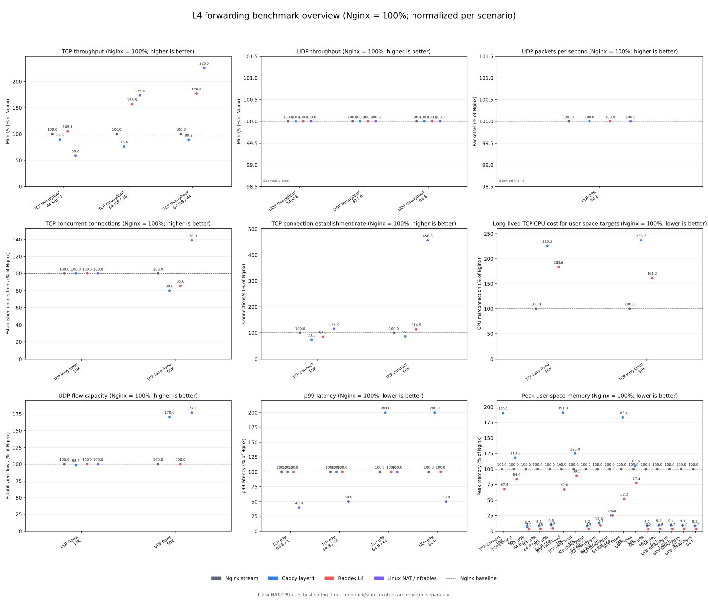

# L4 forwarding benchmark report

This report compares Nginx stream, Caddy layer4, Raddex L4 on Pingora, Raddex L4 on native Tokio, and Linux NAT / nftables.
Nginx is the per-scenario baseline: `100%` means `1.00x`.

- Profile: `full`
- Raddex commit: `b548f6455907ef2f6bee4982273ead070312f05b`
- Run ID: `20260904T064312Z-3135437`
- Kernel: `6.1.0-31-amd64`

## Overview

Every panel uses its own scale. Throughput, PPS, connection rate, and established capacity are higher-is-better; p99 latency, CPU, and memory are lower-is-better.

## Normalized results

| Scenario | Target | Throughput | PPS | Connect/s | Connections | p99 | CPU | Memory | Error rate | Packet loss |
| --- | --- | ---: | ---: | ---: | ---: | ---: | ---: | ---: | ---: | ---: |
| TCP connection rate / 10K connections | Nginx stream | — | — | 100.0% | — | — | 100.0% | 100.0% | 0.000% | 0.000% |
| TCP connection rate / 10K connections | Caddy layer4 | — | — | 73.3% | — | — | 316.0% | 190.1% | 0.000% | 0.000% |
| TCP connection rate / 10K connections | Raddex L4 | — | — | 84.6% | — | — | 254.7% | 67.4% | 0.000% | 0.000% |
| TCP connection rate / 10K connections | Linux NAT / nftables | — | — | 117.2% | — | — | — | — | 0.000% | 0.000% |
| TCP connection rate / 50K connections | Nginx stream | — | — | 100.0% | — | — | 100.0% | 100.0% | 42.394% | 0.000% |
| TCP connection rate / 50K connections | Caddy layer4 | — | — | 86.1% | — | — | 131.8% | 118.1% | 42.358% | 0.000% |
| TCP connection rate / 50K connections | Raddex L4 | — | — | 114.5% | — | — | 83.2% | 84.0% | 34.968% | 0.000% |
| TCP connection rate / 50K connections | Linux NAT / nftables | — | — | 456.8% | — | — | — | — | 2.904% | 0.000% |
| TCP p99 latency / 64 B / 1 connection | Nginx stream | — | — | — | — | 100.0% | 100.0% | 100.0% | 0.000% | 0.000% |
| TCP p99 latency / 64 B / 1 connection | Caddy layer4 | — | — | — | — | 100.0% | 168.8% | 6.7% | 0.000% | 0.000% |
| TCP p99 latency / 64 B / 1 connection | Raddex L4 | — | — | — | — | 100.0% | 119.2% | 3.4% | 0.000% | 0.000% |
| TCP p99 latency / 64 B / 1 connection | Linux NAT / nftables | — | — | — | — | 40.0% | — | — | 0.000% | 0.000% |
| TCP p99 latency / 64 B / 16 connections | Nginx stream | — | — | — | — | 100.0% | 100.0% | 100.0% | 0.000% | 0.000% |
| TCP p99 latency / 64 B / 16 connections | Caddy layer4 | — | — | — | — | 100.0% | 119.8% | 8.1% | 0.000% | 0.000% |
| TCP p99 latency / 64 B / 16 connections | Raddex L4 | — | — | — | — | 100.0% | 115.0% | 3.8% | 0.000% | 0.000% |
| TCP p99 latency / 64 B / 16 connections | Linux NAT / nftables | — | — | — | — | 50.0% | — | — | 0.000% | 0.000% |
| TCP p99 latency / 64 B / 64 connections | Nginx stream | — | — | — | — | 100.0% | 100.0% | 100.0% | 0.000% | 0.000% |
| TCP p99 latency / 64 B / 64 connections | Caddy layer4 | — | — | — | — | 200.0% | 123.6% | 9.5% | 0.000% | 0.000% |
| TCP p99 latency / 64 B / 64 connections | Raddex L4 | — | — | — | — | 100.0% | 122.0% | 4.6% | 0.000% | 0.000% |
| TCP p99 latency / 64 B / 64 connections | Linux NAT / nftables | — | — | — | — | 100.0% | — | — | 0.000% | 0.000% |
| TCP long-lived connections / 10K | Nginx stream | — | — | — | 100.0% | — | 100.0% | 100.0% | 0.000% | 0.000% |
| TCP long-lived connections / 10K | Caddy layer4 | — | — | — | 100.0% | — | 225.2% | 191.0% | 0.000% | 0.000% |
| TCP long-lived connections / 10K | Raddex L4 | — | — | — | 100.0% | — | 183.6% | 67.0% | 0.000% | 0.000% |
| TCP long-lived connections / 10K | Linux NAT / nftables | — | — | — | 100.0% | — | — | — | 0.000% | 0.000% |
| TCP long-lived connections / 50K | Nginx stream | — | — | — | 100.0% | — | 100.0% | 100.0% | 30.798% | 0.000% |
| TCP long-lived connections / 50K | Caddy layer4 | — | — | — | 80.0% | — | 236.7% | 125.0% | 44.626% | 0.000% |
| TCP long-lived connections / 50K | Raddex L4 | — | — | — | 85.6% | — | 161.2% | 89.5% | 40.764% | 0.000% |
| TCP long-lived connections / 50K | Linux NAT / nftables | — | — | — | 138.9% | — | — | — | 3.848% | 0.000% |
| TCP throughput / 64 KiB / 1 connection | Nginx stream | 100.0% | — | — | — | — | 100.0% | 100.0% | 0.000% | 0.000% |
| TCP throughput / 64 KiB / 1 connection | Caddy layer4 | 89.6% | — | — | — | — | 117.3% | 8.2% | 0.000% | 0.000% |
| TCP throughput / 64 KiB / 1 connection | Raddex L4 | 105.1% | — | — | — | — | 96.9% | 3.8% | 0.000% | 0.000% |
| TCP throughput / 64 KiB / 1 connection | Linux NAT / nftables | 58.6% | — | — | — | — | — | — | 0.000% | 0.000% |
| TCP throughput / 64 KiB / 16 connections | Nginx stream | 100.0% | — | — | — | — | 100.0% | 100.0% | 0.000% | 0.000% |
| TCP throughput / 64 KiB / 16 connections | Caddy layer4 | 76.6% | — | — | — | — | 129.8% | 12.6% | 0.000% | 0.000% |
| TCP throughput / 64 KiB / 16 connections | Raddex L4 | 156.5% | — | — | — | — | 64.4% | 9.3% | 0.000% | 0.000% |
| TCP throughput / 64 KiB / 16 connections | Linux NAT / nftables | 173.4% | — | — | — | — | — | — | 0.000% | 0.000% |
| TCP throughput / 64 KiB / 64 connections | Nginx stream | 100.0% | — | — | — | — | 100.0% | 100.0% | 0.000% | 0.000% |
| TCP throughput / 64 KiB / 64 connections | Caddy layer4 | 89.2% | — | — | — | — | 112.4% | 25.4% | 0.000% | 0.000% |
| TCP throughput / 64 KiB / 64 connections | Raddex L4 | 176.6% | — | — | — | — | 57.6% | 25.1% | 0.000% | 0.000% |
| TCP throughput / 64 KiB / 64 connections | Linux NAT / nftables | 225.5% | — | — | — | — | — | — | 0.000% | 0.000% |
| UDP flows / 10K clients | Nginx stream | — | — | — | 100.0% | — | 100.0% | 100.0% | 0.000% | 0.000% |
| UDP flows / 10K clients | Caddy layer4 | — | — | — | 98.5% | — | 340.5% | 183.4% | 1.510% | 0.000% |
| UDP flows / 10K clients | Raddex L4 | — | — | — | 100.0% | — | 115.4% | 52.2% | 0.000% | 0.000% |
| UDP flows / 10K clients | Linux NAT / nftables | — | — | — | 100.0% | — | — | — | 0.000% | 0.000% |
| UDP flows / 50K clients | Nginx stream | — | — | — | 100.0% | — | 100.0% | 100.0% | 43.538% | 0.000% |
| UDP flows / 50K clients | Caddy layer4 | — | — | — | 170.6% | — | 46.7% | 105.5% | 3.664% | 0.000% |
| UDP flows / 50K clients | Raddex L4 | — | — | — | 100.0% | — | 99.2% | 77.4% | 43.538% | 0.000% |
| UDP flows / 50K clients | Linux NAT / nftables | — | — | — | 177.1% | — | — | — | 0.016% | 0.000% |
| UDP p99 latency / 64 B datagrams | Nginx stream | — | — | — | — | 100.0% | 100.0% | 100.0% | 0.000% | 0.000% |
| UDP p99 latency / 64 B datagrams | Caddy layer4 | — | — | — | — | 200.0% | 240.4% | 8.0% | 0.000% | 0.000% |
| UDP p99 latency / 64 B datagrams | Raddex L4 | — | — | — | — | 100.0% | 118.3% | 3.5% | 0.000% | 0.000% |
| UDP p99 latency / 64 B datagrams | Linux NAT / nftables | — | — | — | — | 50.0% | — | — | 0.000% | 0.000% |
| UDP packets per second / 64 B datagrams | Nginx stream | — | 100.0% | — | — | — | 100.0% | 100.0% | 0.000% | 0.000% |
| UDP packets per second / 64 B datagrams | Caddy layer4 | — | 100.0% | — | — | — | 163.0% | 9.4% | 0.000% | 0.000% |
| UDP packets per second / 64 B datagrams | Raddex L4 | — | 100.0% | — | — | — | 139.3% | 3.8% | 0.000% | 0.000% |
| UDP packets per second / 64 B datagrams | Linux NAT / nftables | — | 100.0% | — | — | — | — | — | 0.000% | 0.000% |
| UDP throughput / 1400 B datagrams | Nginx stream | 100.0% | — | — | — | — | 100.0% | 100.0% | 0.000% | 0.000% |
| UDP throughput / 1400 B datagrams | Caddy layer4 | 100.0% | — | — | — | — | 182.3% | 9.4% | 0.000% | 0.000% |
| UDP throughput / 1400 B datagrams | Raddex L4 | 100.0% | — | — | — | — | 111.5% | 3.7% | 0.000% | 0.000% |
| UDP throughput / 1400 B datagrams | Linux NAT / nftables | 100.0% | — | — | — | — | — | — | 0.000% | 0.000% |
| UDP throughput / 512 B datagrams | Nginx stream | 100.0% | — | — | — | — | 100.0% | 100.0% | 0.000% | 0.000% |
| UDP throughput / 512 B datagrams | Caddy layer4 | 100.0% | — | — | — | — | 150.8% | 9.1% | 0.000% | 0.000% |
| UDP throughput / 512 B datagrams | Raddex L4 | 100.0% | — | — | — | — | 103.4% | 3.7% | 0.000% | 0.000% |
| UDP throughput / 512 B datagrams | Linux NAT / nftables | 100.0% | — | — | — | — | — | — | 0.000% | 0.000% |
| UDP throughput / 64 B datagrams | Nginx stream | 100.0% | — | — | — | — | 100.0% | 100.0% | 0.000% | 0.000% |
| UDP throughput / 64 B datagrams | Caddy layer4 | 100.0% | — | — | — | — | 177.3% | 8.2% | 0.000% | 0.000% |
| UDP throughput / 64 B datagrams | Raddex L4 | 100.0% | — | — | — | — | 105.9% | 3.7% | 0.000% | 0.000% |
| UDP throughput / 64 B datagrams | Linux NAT / nftables | 100.0% | — | — | — | — | — | — | 0.000% | 0.000% |

## Linux NAT kernel state

| Scenario | Conntrack entries | nf_conntrack objects | nf_conntrack bytes (approx.) | Host softirq ms |
| --- | ---: | ---: | ---: | ---: |
| TCP connection rate / 10K connections | 10002 | 75004 | 19201024 | 2521080.0 |
| TCP connection rate / 50K connections | 48166 | 170595 | 43672320 | 11902760.0 |
| TCP p99 latency / 64 B / 1 connection | 3 | 1088 | 278528 | 4276420.0 |
| TCP p99 latency / 64 B / 16 connections | 18 | 885 | 226560 | 17724840.0 |
| TCP p99 latency / 64 B / 64 connections | 66 | 1444 | 369664 | 25166060.0 |
| TCP long-lived connections / 10K | 10001 | 67418 | 17259008 | 2892660.0 |
| TCP long-lived connections / 50K | 47981 | 180800 | 46284800 | 12502780.0 |
| TCP throughput / 64 KiB / 1 connection | 3 | 1120 | 286720 | 5069460.0 |
| TCP throughput / 64 KiB / 16 connections | 18 | 1088 | 278528 | 48970580.0 |
| TCP throughput / 64 KiB / 64 connections | 66 | 1349 | 345344 | 55776640.0 |
| UDP flows / 10K clients | 10002 | 50992 | 13053952 | 2209520.0 |
| UDP flows / 50K clients | 40042 | 157147 | 40229632 | 8040260.0 |
| UDP p99 latency / 64 B datagrams | 3 | 928 | 237568 | 3488280.0 |
| UDP packets per second / 64 B datagrams | 3 | 960 | 245760 | 4281920.0 |
| UDP throughput / 1400 B datagrams | 3 | 960 | 245760 | 2278440.0 |
| UDP throughput / 512 B datagrams | 3 | 960 | 245760 | 2283060.0 |
| UDP throughput / 64 B datagrams | 3 | 960 | 245760 | 2283380.0 |

The conntrack byte value is an approximate active-slab footprint, not process RSS.

## Cgroup accounting

| Scenario | Target | memory.current peak | memory.peak | anon | file | kernel | sock | pids | threads |
| --- | --- | ---: | ---: | ---: | ---: | ---: | ---: | ---: | ---: |
| TCP connection rate / 10K connections | Nginx stream | 363.2 MiB | 364.6 MiB | 307.9 MiB | 0.0 MiB | 55.2 MiB | 2.8 MiB | 3 | 1 |
| TCP connection rate / 10K connections | Caddy layer4 | 690.1 MiB | 709.0 MiB | 634.6 MiB | 0.0 MiB | 55.5 MiB | 0.2 MiB | 11 | 11 |
| TCP connection rate / 10K connections | Raddex L4 | 244.9 MiB | 253.1 MiB | 190.2 MiB | — | 54.7 MiB | 12.4 MiB | 13 | 13 |
| TCP connection rate / 10K connections | Linux NAT / nftables | 1.0 MiB | 15.7 MiB | 0.1 MiB | — | 1.1 MiB | — | 3 | 1 |
| TCP connection rate / 50K connections | Nginx stream | 867.1 MiB | 867.4 MiB | 679.2 MiB | 0.0 MiB | 154.1 MiB | 62.7 MiB | 3 | 1 |
| TCP connection rate / 50K connections | Caddy layer4 | 1024.0 MiB | 1031.3 MiB | 916.9 MiB | 0.4 MiB | 159.4 MiB | 106.0 MiB | 38 | 38 |
| TCP connection rate / 50K connections | Raddex L4 | 728.4 MiB | 728.9 MiB | 530.0 MiB | — | 153.7 MiB | 56.7 MiB | 13 | 13 |
| TCP connection rate / 50K connections | Linux NAT / nftables | 4.7 MiB | 16.8 MiB | 5.7 MiB | — | 1.3 MiB | — | 6 | 1 |
| TCP p99 latency / 64 B / 1 connection | Nginx stream | 170.1 MiB | 170.5 MiB | 169.1 MiB | 0.0 MiB | 0.9 MiB | 0.0 MiB | 3 | 1 |
| TCP p99 latency / 64 B / 1 connection | Caddy layer4 | 11.3 MiB | 12.2 MiB | 10.7 MiB | 0.1 MiB | 0.6 MiB | 0.0 MiB | 7 | 7 |
| TCP p99 latency / 64 B / 1 connection | Raddex L4 | 6.1 MiB | 7.8 MiB | 5.1 MiB | — | 0.8 MiB | 0.0 MiB | 13 | 13 |
| TCP p99 latency / 64 B / 1 connection | Linux NAT / nftables | 1.1 MiB | 12.2 MiB | 0.1 MiB | — | 0.9 MiB | — | 1 | 1 |
| TCP p99 latency / 64 B / 16 connections | Nginx stream | 170.7 MiB | 171.3 MiB | 169.4 MiB | 0.0 MiB | 1.0 MiB | 0.1 MiB | 3 | 1 |
| TCP p99 latency / 64 B / 16 connections | Caddy layer4 | 13.8 MiB | 14.8 MiB | 12.8 MiB | 0.0 MiB | 0.7 MiB | 0.1 MiB | 8 | 8 |
| TCP p99 latency / 64 B / 16 connections | Raddex L4 | 6.5 MiB | 8.1 MiB | 5.4 MiB | — | 0.9 MiB | 0.1 MiB | 13 | 13 |
| TCP p99 latency / 64 B / 16 connections | Linux NAT / nftables | 1.1 MiB | 11.6 MiB | 0.1 MiB | — | 0.8 MiB | — | 1 | 1 |
| TCP p99 latency / 64 B / 64 connections | Nginx stream | 171.8 MiB | 172.8 MiB | 170.0 MiB | 0.0 MiB | 1.2 MiB | 0.2 MiB | 3 | 1 |
| TCP p99 latency / 64 B / 64 connections | Caddy layer4 | 16.4 MiB | 17.6 MiB | 14.9 MiB | 0.0 MiB | 1.0 MiB | 0.2 MiB | 8 | 8 |
| TCP p99 latency / 64 B / 64 connections | Raddex L4 | 8.1 MiB | 9.1 MiB | 6.3 MiB | — | 1.1 MiB | 0.2 MiB | 13 | 13 |
| TCP p99 latency / 64 B / 64 connections | Linux NAT / nftables | 1.1 MiB | 15.5 MiB | 0.1 MiB | — | 0.8 MiB | — | 1 | 1 |
| TCP long-lived connections / 10K | Nginx stream | 368.3 MiB | 369.3 MiB | 313.0 MiB | 0.0 MiB | 55.2 MiB | 1.5 MiB | 3 | 1 |
| TCP long-lived connections / 10K | Caddy layer4 | 703.8 MiB | 709.5 MiB | 648.1 MiB | 0.2 MiB | 55.5 MiB | 18.3 MiB | 9 | 9 |
| TCP long-lived connections / 10K | Raddex L4 | 246.9 MiB | 277.9 MiB | 192.2 MiB | — | 54.7 MiB | 21.1 MiB | 13 | 13 |
| TCP long-lived connections / 10K | Linux NAT / nftables | 1.1 MiB | 12.5 MiB | 0.1 MiB | — | 0.9 MiB | — | 2 | 1 |
| TCP long-lived connections / 50K | Nginx stream | 818.9 MiB | 819.2 MiB | 616.3 MiB | 0.0 MiB | 154.1 MiB | 49.8 MiB | 3 | 1 |
| TCP long-lived connections / 50K | Caddy layer4 | 1024.0 MiB | 1030.6 MiB | 918.0 MiB | 0.4 MiB | 158.3 MiB | 79.3 MiB | 44 | 44 |
| TCP long-lived connections / 50K | Raddex L4 | 732.5 MiB | 733.0 MiB | 531.4 MiB | — | 154.5 MiB | 62.2 MiB | 13 | 13 |
| TCP long-lived connections / 50K | Linux NAT / nftables | 1.6 MiB | 18.4 MiB | 3.8 MiB | — | 1.2 MiB | — | 4 | 1 |
| TCP throughput / 64 KiB / 1 connection | Nginx stream | 171.0 MiB | 171.7 MiB | 169.2 MiB | 0.0 MiB | 0.9 MiB | 0.4 MiB | 3 | 1 |
| TCP throughput / 64 KiB / 1 connection | Caddy layer4 | 14.0 MiB | 15.0 MiB | 12.7 MiB | 0.1 MiB | 0.6 MiB | 0.5 MiB | 7 | 7 |
| TCP throughput / 64 KiB / 1 connection | Raddex L4 | 6.6 MiB | 9.7 MiB | 5.2 MiB | — | 0.8 MiB | 0.2 MiB | 13 | 13 |
| TCP throughput / 64 KiB / 1 connection | Linux NAT / nftables | 1.1 MiB | 12.0 MiB | 0.1 MiB | — | 0.9 MiB | — | 1 | 1 |
| TCP throughput / 64 KiB / 16 connections | Nginx stream | 179.6 MiB | 181.9 MiB | 169.8 MiB | 0.0 MiB | 1.0 MiB | 8.3 MiB | 3 | 1 |
| TCP throughput / 64 KiB / 16 connections | Caddy layer4 | 22.2 MiB | 24.4 MiB | 12.7 MiB | 0.1 MiB | 0.7 MiB | 7.9 MiB | 8 | 8 |
| TCP throughput / 64 KiB / 16 connections | Raddex L4 | 17.6 MiB | 20.8 MiB | 9.4 MiB | — | 0.9 MiB | 6.8 MiB | 13 | 13 |
| TCP throughput / 64 KiB / 16 connections | Linux NAT / nftables | 1.0 MiB | 11.3 MiB | 0.1 MiB | — | 0.8 MiB | — | 1 | 1 |
| TCP throughput / 64 KiB / 64 connections | Nginx stream | 208.8 MiB | 211.8 MiB | 171.6 MiB | 0.0 MiB | 1.2 MiB | 35.4 MiB | 3 | 1 |
| TCP throughput / 64 KiB / 64 connections | Caddy layer4 | 53.9 MiB | 55.9 MiB | 16.9 MiB | 0.2 MiB | 1.0 MiB | 35.1 MiB | 9 | 9 |
| TCP throughput / 64 KiB / 64 connections | Raddex L4 | 51.1 MiB | 54.0 MiB | 14.4 MiB | — | 1.1 MiB | 34.3 MiB | 13 | 13 |
| TCP throughput / 64 KiB / 64 connections | Linux NAT / nftables | 0.9 MiB | 13.2 MiB | 0.1 MiB | — | 0.5 MiB | — | 1 | 1 |
| UDP flows / 10K clients | Nginx stream | 392.6 MiB | 393.4 MiB | 326.0 MiB | 0.0 MiB | 27.5 MiB | 39.1 MiB | 3 | 1 |
| UDP flows / 10K clients | Caddy layer4 | 720.5 MiB | 723.5 MiB | 653.5 MiB | 0.2 MiB | 27.4 MiB | 38.5 MiB | 10 | 10 |
| UDP flows / 10K clients | Raddex L4 | 204.8 MiB | 205.2 MiB | 137.9 MiB | — | 27.9 MiB | 39.1 MiB | 13 | 13 |
| UDP flows / 10K clients | Linux NAT / nftables | 1.2 MiB | 13.9 MiB | 0.1 MiB | — | 1.1 MiB | — | 1 | 1 |
| UDP flows / 50K clients | Nginx stream | 971.4 MiB | 972.1 MiB | 784.1 MiB | 1.2 MiB | 76.0 MiB | 110.6 MiB | 3 | 1 |
| UDP flows / 50K clients | Caddy layer4 | 1023.9 MiB | 1024.2 MiB | 898.2 MiB | 3.0 MiB | 58.8 MiB | 84.0 MiB | 10 | 10 |
| UDP flows / 50K clients | Raddex L4 | 750.8 MiB | 751.1 MiB | 563.3 MiB | — | 77.2 MiB | 110.6 MiB | 13 | 13 |
| UDP flows / 50K clients | Linux NAT / nftables | 5.7 MiB | 16.4 MiB | 3.8 MiB | — | 1.1 MiB | — | 1 | 1 |
| UDP p99 latency / 64 B datagrams | Nginx stream | 170.1 MiB | 170.8 MiB | 169.2 MiB | 0.0 MiB | 0.9 MiB | 0.0 MiB | 3 | 1 |
| UDP p99 latency / 64 B datagrams | Caddy layer4 | 13.5 MiB | 14.2 MiB | 12.8 MiB | 0.1 MiB | 0.6 MiB | 0.0 MiB | 7 | 7 |
| UDP p99 latency / 64 B datagrams | Raddex L4 | 5.9 MiB | 9.7 MiB | 5.1 MiB | — | 0.8 MiB | 0.0 MiB | 13 | 13 |
| UDP p99 latency / 64 B datagrams | Linux NAT / nftables | 1.3 MiB | 11.9 MiB | 0.1 MiB | — | 0.9 MiB | — | 1 | 1 |
| UDP packets per second / 64 B datagrams | Nginx stream | 170.6 MiB | 171.0 MiB | 169.2 MiB | 0.0 MiB | 0.9 MiB | 0.1 MiB | 3 | 1 |
| UDP packets per second / 64 B datagrams | Caddy layer4 | 16.0 MiB | 16.4 MiB | 14.9 MiB | 0.0 MiB | 0.6 MiB | 0.1 MiB | 8 | 8 |
| UDP packets per second / 64 B datagrams | Raddex L4 | 6.5 MiB | 9.6 MiB | 5.1 MiB | — | 0.8 MiB | 0.1 MiB | 13 | 13 |
| UDP packets per second / 64 B datagrams | Linux NAT / nftables | 1.0 MiB | 13.1 MiB | 0.1 MiB | — | 0.8 MiB | — | 1 | 1 |
| UDP throughput / 1400 B datagrams | Nginx stream | 170.4 MiB | 170.9 MiB | 169.2 MiB | 0.0 MiB | 0.9 MiB | 0.1 MiB | 3 | 1 |
| UDP throughput / 1400 B datagrams | Caddy layer4 | 15.8 MiB | 16.3 MiB | 14.9 MiB | 0.0 MiB | 0.6 MiB | 0.0 MiB | 8 | 8 |
| UDP throughput / 1400 B datagrams | Raddex L4 | 6.4 MiB | 9.4 MiB | 5.1 MiB | — | 0.8 MiB | 0.1 MiB | 13 | 13 |
| UDP throughput / 1400 B datagrams | Linux NAT / nftables | 1.1 MiB | 16.6 MiB | 0.1 MiB | — | 0.8 MiB | — | 1 | 1 |
| UDP throughput / 512 B datagrams | Nginx stream | 170.6 MiB | 170.9 MiB | 169.2 MiB | 0.0 MiB | 0.9 MiB | 0.0 MiB | 3 | 1 |
| UDP throughput / 512 B datagrams | Caddy layer4 | 15.8 MiB | 16.4 MiB | 14.9 MiB | 0.0 MiB | 0.6 MiB | 0.0 MiB | 8 | 8 |
| UDP throughput / 512 B datagrams | Raddex L4 | 6.4 MiB | 9.5 MiB | 5.1 MiB | — | 0.8 MiB | 0.1 MiB | 13 | 13 |
| UDP throughput / 512 B datagrams | Linux NAT / nftables | 1.1 MiB | 12.1 MiB | 0.1 MiB | — | 0.8 MiB | — | 1 | 1 |
| UDP throughput / 64 B datagrams | Nginx stream | 170.6 MiB | 171.0 MiB | 169.2 MiB | 0.0 MiB | 0.9 MiB | 0.0 MiB | 3 | 1 |
| UDP throughput / 64 B datagrams | Caddy layer4 | 13.8 MiB | 14.6 MiB | 12.9 MiB | 0.0 MiB | 0.6 MiB | 0.0 MiB | 8 | 8 |
| UDP throughput / 64 B datagrams | Raddex L4 | 6.4 MiB | 9.7 MiB | 5.2 MiB | — | 0.8 MiB | 0.1 MiB | 13 | 13 |
| UDP throughput / 64 B datagrams | Linux NAT / nftables | 1.1 MiB | 11.9 MiB | 0.1 MiB | — | 0.9 MiB | — | 1 | 1 |

Cgroup memory fields are raw accounting signals and are not substituted for the normalized peak-memory metric.

## Interpretation

- Fixed-size TCP/UDP data scenarios measure forwarding work at the configured payload size.
- Connection and flow scenarios measure successful objects held during the duration; they are not request throughput.
- Linux NAT performs forwarding in the kernel. Its process cgroup RSS is not conntrack memory, so conntrack and slab counters are kept as separate raw fields.
- Results from different machines must not be merged by absolute throughput or latency.
